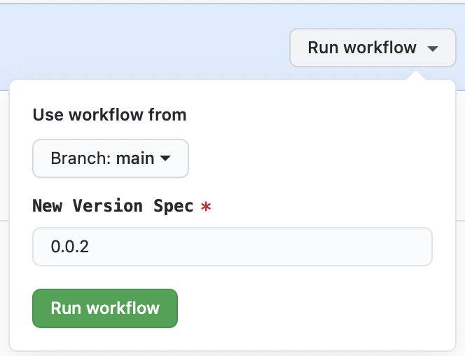
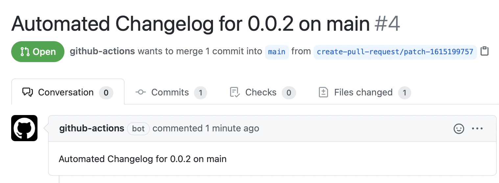

# Release Helper

## Motivation

A set of helper scripts and example GitHub Action workflows to aid in automated releases of Python and npm packages.

- Enforces best practices:

  - Has automated changelog for every release (optional)
  - Is published to test server and verified with install and import of dist asset(s)
  - Has commit message with hashes of dist file(s)
  - Has annotated git tag in standard format
  - Has GitHub release with changelog entry
  - Reverts to Dev version after release (optional)
  - Ensures packages are publishable on every commit

- Prerequisites (see [checklist](#Checklist-for-Adoption) below for details):

  - Markdown change log (optional)
  - Bump version configuration
  - Write access to GitHub repo and PyPI/npm registries for the package for one or more maintainers
  - ⚠️ **SECURITY NOTE:** It is highly advised that the actual release workflow be run on a fork using API tokens generated by the maintainer. This allows the releases to be made in that person's name, and allows publish access to be controlled. Anyone with write access to a repository can run a workflow.

- Typical workflow:
  - When ready to make a release, go to the source repository and go to the Actions panel
  - Select the Prepare Changelog workflow
  - Run the Workflow with the version spec (usually the new version number), and make sure the target branch is correct



- When the run completes, review the changelog PR that was opened, making any desired edits



- Merge the PR
- The maintainer goes to the GitHub page for their fork and gos to the Actions panel
- Select the Create Release workflow


- Run the Workflow with the same version spec as before, and an optional post version spec if you want to go back to a dev version in the target branch. Select the appropriate branch as well
- When the workflow completes, go to the releases page in the main repository and verify that the new release is there with the correct changelog. You can also go to PyPI and/or npm to verify the package(s) are available.

## Installation

To install the latest release locally, make sure you have
[pip installed](https://pip.readthedocs.io/en/stable/installing/) and run:

```
    pip install git+https://github.com/jupyter-server/release-helper
```

## Usage

```
    release-helper --help
    release-helper prep-python --help
```

## Checklist for Adoption

**Note**: The automated changelog handling is optional. If it is not desired, you can use the
`check_release` and `create_release` workflows only and leave the changelog calls out of them. You will need to generate your own text for the GitHub release.

- [ ] Switch to Markdown Changelog
  - We recommend [MyST](https://myst-parser.readthedocs.io/en/latest/?badge=latest), especially if some of your docs are in reStructuredText
  - Can use `pandoc -s changelog.rst -o changelog.md` and some hand edits as needed
  - Note that [directives](https://myst-parser.readthedocs.io/en/latest/using/syntax.html#syntax-directives) can still be used
- [ ] Add HTML start and end comment markers to Change log file - see example XXX
- [ ] Add [tbump](https://github.com/tankerhq/tbump) support - see example XXX
- [ ] All publishers set up [secrets](https://docs.github.com/en/actions/reference/encrypted-secrets#creating-encrypted-secrets-for-a-repository) in their fork:
  - [ ] Create [`PYPI_TOKEN`](https://packaging.python.org/guides/publishing-package-distribution-releases-using-github-actions-ci-cd-workflows/#saving-credentials-on-github) and `TEST_PYPI_TOKEN` (if needed)
  - [ ] Create [`NPM_TOKEN`](https://docs.npmjs.com/creating-and-viewing-access-tokens) (if needed)
  - [ ] Create [`REPO_ACCESS_TOKEN`](https://docs.github.com/en/github/authenticating-to-github/creating-a-personal-access-token) with `public_repo` access
- [ ] One publisher adds their `TEST_PYPI_TOKEN` to the source repo's secrets for the release check workflow
- [ ] Add workflows for `check_release`, `create_changelog`, and `create_release` - see our examples XXX
- [ ] Start with the test PyPI server in `create-release`, then switch to the production server once it is fully working
- [ ] If desired, add workflows, change log, and `tbump` support to other active release branches

## Create ChangeLog Workflow Details

- Manual Github workflow
- Input is the version spec
- Targets the branch selected when starting the workflow
- Bumps the version
  - By default, uses [tbump](https://github.com/tankerhq/tbump) or [bump2version](https://github.com/c4urself/bump2version) to bump the version based on presence of config files
    - We recommend `tbump` instead of `bump2version` for most cases because it does not handle patch releases well when using [prereleases](https://github.com/c4urself/bump2version/issues/190).
- Prepares the environment
  - Sets up git config and branch
  - Exports environment variables to [`GITHUB_ENV`](https://docs.github.com/en/actions/reference/environment-variables) so they can be used in further steps
- Generates a changelog (using [github-activity](https://github.com/executablebooks/github-activity)) using the PRs since the last tag on this branch.
  - Gets the current version and then does a git checkout to clear state
  - Adds a new version entry using a HTML comment markers in the changelog file
  - Optionally resolves [meeseeks](https://github.com/MeeseeksBox/MeeseeksDev) backport PRs to their original PR
- Creates a PR with the changelog changes.
- Notes:
  - This can be run on the repo by anyone with write access, since it only needs the built in `secrets.GITHUB_ACCESS_TOKEN`
  - The automated PR does not start workflows (a limitation of GitHub Actions). If you hand-edit the file to make formatting/grammar changes, it will run the workflows.
  - Can be re-run using the same version spec. It will add new entries but preserve existing ones (in case they have been hand modified).

## Create-Release Workflow Details

- Manual Github workflow
- Takes a version spec, optional post version spec, and optional branch
- Targets the branch selected when starting the workflow by default
- Ensures that the workflow file is the same one as the target branch
- Bumps version using the same method as the changelog action
- Prepares the environment using the same method as the changelog action
- Verifies the changelog entry
  - Looks for the current entry using the HTML comment markers
  - Gets the expected changelog values using `github-activity`
  - Ensures that all PRs are the same between the two
  - Writes the changelog entry out to a file to be used as the GitHub Release text
- If there is a Python package
  - Runs [`check-manifest`](https://github.com/mgedmin/check-manifest#configuration) if config is available
  - Builds the wheel and source distributions
  - Makes dists can be installed and imported in a virtual environment
- NPM and lerna support are forthcoming - See TODO
- Adds a commit that includes the hashes of the dist files
- Creates an annotated version tag in standard format
- If given, bumps the version using the post version spec
- Pushes the commits and tag to the target `branch`
- Creates a GitHub release for the tag with the changelog entry as the text
- Publishes the release to PyPI (NPM support coming soon)

## Check-Release Workflow Details

- Runs as a standard workflow
- Runs both the Change log steps and the Create Release Steps
- Does not make PRs or push git changes
- Publishes to the test PyPI server
- Creates a draft GitHub release and removes it

## TODO

- jupyter/notebook migration:

  - Can be done immediately using the checklist
  - Add `tbump` config to replace [`jsversion`](https://github.com/jupyter/notebook/blob/4b2e849e83fcf9ffbe0755d38d635e34e56a4fea/setupbase.py#L583) step
  - Add `babel` and `npm` dependencies in the install step of the new workflows

- npm/lerna support

  - Make an npm package that lives in the `release-helper` repo
  - Find [workspace packages](https://github.com/jupyterlab/jupyterlab/blob/9f50c45b39e289072d4c18519ca29c974c226f69/buildutils/src/utils.ts#L16) for lerna support
  - Publish package(s) to a [verdaccio server](https://github.com/facebook/create-react-app/blob/7e4949a20fc828577fb7626a3262832422f3ae3b/tasks/verdaccio.yaml)
  - Incorporate jupyterlab [publish script](https://github.com/jupyterlab/jupyterlab/blob/532eb4161c01bc7e93e86c4ecb8cd1728e498458/buildutils/src/publish.ts) to pick up `dist-tag` cleanup
  - To test installation of package(s), create a temporary npm package and install/require the new package(s)

- jupyterlab/lumino migration:

  - We need to manually update the JS versions since we are in lerna independent mode. We will push the commit and resulting tags directly to the branch.
  - Use the top level `package.json` as the versioned file (but still keep it private)
  - After creating the changelog, use the date instead of the version and add the JS packages

- jupyterlab/jupyterlab migration:
  - Changelog PR text should show the JS package version changes so we can audit them
  - Pass a `--yes` flag to lerna `version` and `publish` when releasing on CI
  - Keep using `bump2version` since we need to use them for the JS packages, but collapse patch release into `jlpm bumpversion patch`
  - Remove `publish.ts` in favor of the one in `release-helper`.
  - Since we're using verdaccio, we don't need to wait for packages to be available to run [`update-core-mode`](https://github.com/jupyterlab/jupyterlab/blob/9f50c45b39e289072d4c18519ca29c974c226f69/buildutils/src/update-core-mode.ts), so we can just run that directly and remove `prepare-python-release`
  - Use the verdaccio server to run the [`release_test`](https://github.com/jupyterlab/jupyterlab/blob/9f50c45b39e289072d4c18519ca29c974c226f69/scripts/release_test.sh) after the npm prep command
  - We then have to update the `jupyterlab/staging/yarn.lock` file to replace the verdaccio registry with the public one.
  - Add `lab-prod` endpoint in [binder](https://github.com/jupyterlab/jupyterlab/blob/9f50c45b39e289072d4c18519ca29c974c226f69/binder/jupyter_notebook_config.py#L17) so we can actually test with "released" packages for a given commit
